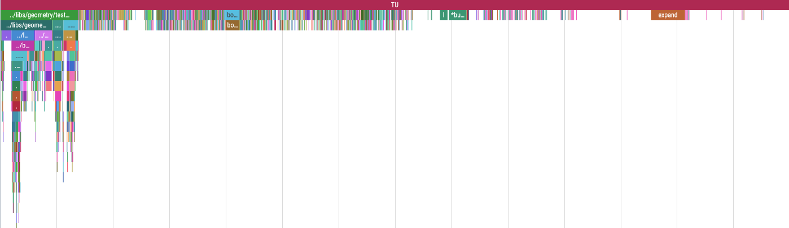

# Externis

## What is Externis?

Externis is a GCC plugin that generates profiling traces of the compilation
process. The traces are viewable as a flame chart. It is inspired by clang's
`-ftime-trace` feature.

The trace files generated by Externis are in the standard
[trace event format](https://profilerpedia.markhansen.co.nz/formats/trace-event-format/).
They may be viewed in Google's [Perfetto UI](https://ui.perfetto.dev) or in
similar visualization tools.

## Example

This image shows a trace file made by compiling a test from `boost::geometry`.
The trace is viewed through Perfetto UI. You can download this example trace
[here](./docs/example_trace.json) and play with it yourself.



You will notice the larger blocks at the start. This is the time the compiler
spends on pre-processing the needed headers. After that, there's a long time
where the compiler spends time compiling each individual function, but each
function itself doesn't take very long. At the end there are few large blocks
that are the optimization passes, executed one-by-one on the whole translation
unit.

Events shorter than 1ms are filtered out and not written to the trace, to save
on disk space.

## Building

The requirements for building Externis are:
 1. **A GCC compiler supporting C++20.** This plugin is tested with GCC11, but older
    versions might work as well.
 2. **The GCC plugin headers.** If you're using the GCC provided by your OS' package
    manager there's usually a package named `gcc-plugin-devel` or something
    similar to get the GCC plugin headers installed.
 3. **CMake** (but barely).

After downloading the source code, you can build and install the plugin with

```bash
mkdir build && cd build
cmake ..
make externis
sudo make install
```

By default, Externis is installed into GCC's plugin directory, but you can control this behaviour with the CMake option `EXTERNIS_INSTALL_TO_PLUGIN_DIR`.

Prebuilt binaries may be provided in the future.

### Cross-Compilation

By default, the externis build will execute
`${CMAKE_CXX_COMPILER} -print-file-name=plugin` to determine the location of
the gcc plugin header and plugin install location. If you plan to use externis
with the compiler that you use to build externis, this works just fine; however,
if you want to build externis for use with a different `g++` (for example,
`g++-arm-none-eabi`), this will not work.

To build externis for use with some other `g++`, find the plugin dir for that
gcc (You can run `g++-arm-none-eabi -print-file-name=plugin` yourself), and
configure externis with `-DEXTERNIS_GCC_PLUGIN_DIR=[that path]`, or for
shorthand, use
`cmake -DEXTERNIS_GCC_PLUGIN_DIR=$([your g++] -print-file-name=plugin)`. When
doing this, it will likely also be necessary to use `-DEXTERNIS_BUILD_TEST=OFF`
to disable the build test validates externis.

## Usage

After building the plugin, you can use it by passing the following additional
arguments to GCC:
```bash
# If it's install to GCC's plugin folder
gcc <regular arguments> -fplugin=externis -fplugin-arg-externis-trace=SOME_PATH/trace.json
# Otherwise:
gcc <regular arguments> -fplugin=/PATH/TO/build/externis.so -fplugin-arg-externis-trace=SOME_PATH/trace.json
```
Alternatively, you can specify a directory to write the files to:
```bash
gcc <regular arguments> -fplugin=/PATH/TO/build/externis.so -fplugin-arg-externis-trace-dir=SOME_PATH/
```
In which case the output will be written to SOME_PATH/trace_XXXXXX.json
If a trace output path or directory is not given, a temporary file with the name
`/tmp/trace_XXXXXX.json` will be used instead.

## License & Copyright

This plugin was written by Roy Jacobson and is released under the GPLv3 license.

The example trace file is a derived work of boost and provided under the [Boost
Software License](./docs/boost_license.txt).
